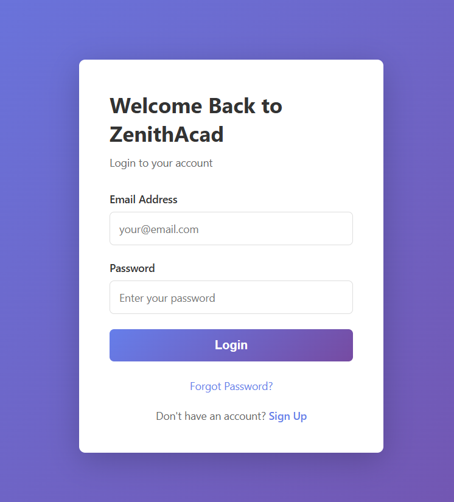
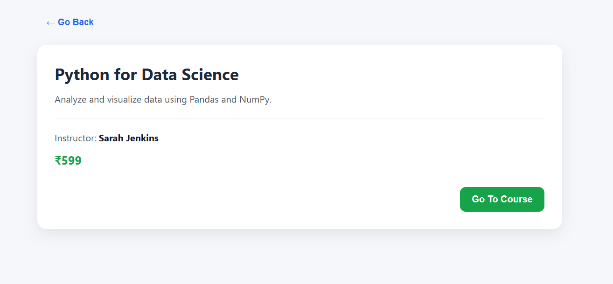
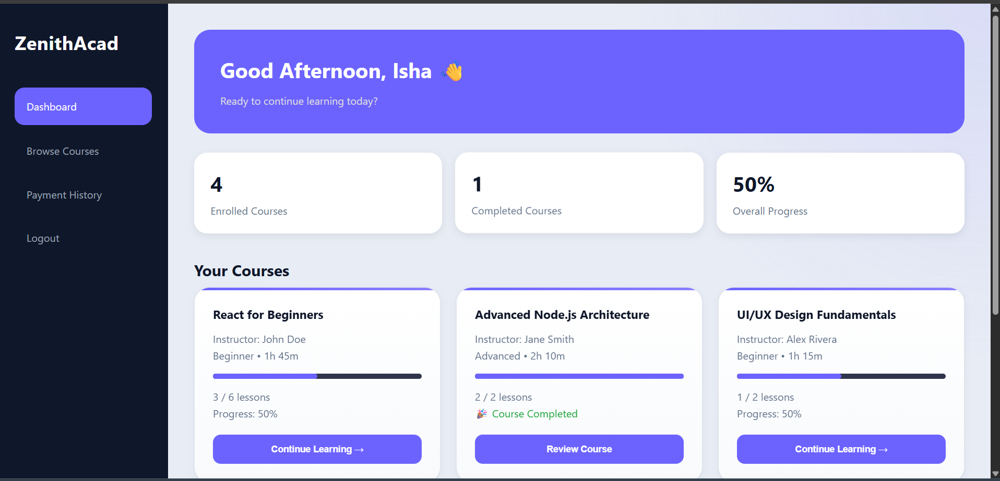
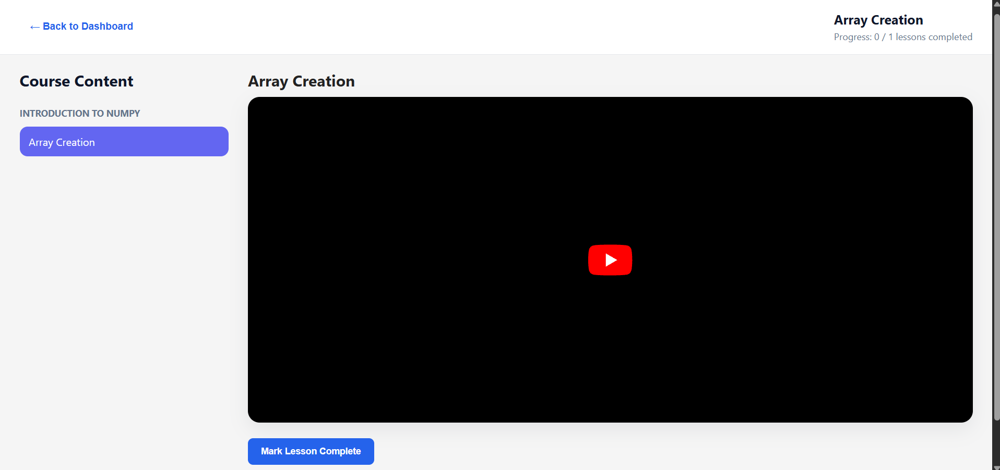
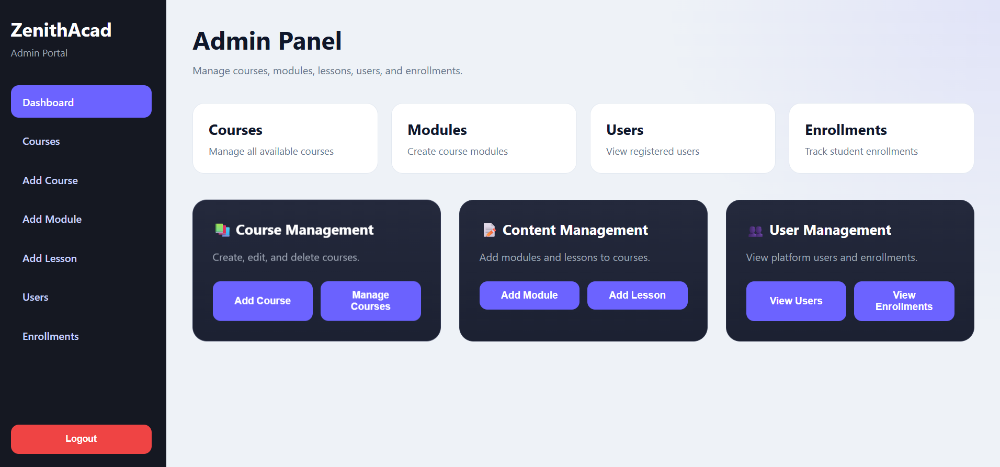

# Online Course Platform


A full-stack e-learning platform where users can browse courses, enroll through Razorpay, and access learning content organized into modules and lessons. Administrators can manage courses and monitor users and enrollments.

---

## Live Demo

[Demo Video - Watch on YouTube](https://youtu.be/cQUA293ERzg)

---

## Objective

Develop a full-stack online learning platform that enables users to browse and purchase courses, access structured learning content, and track progress, while allowing administrators to manage courses, modules, lessons, users, and enrollments.

---

## Features

### 1. Authentication

* User Registration
* User Login
* JWT-based Authentication
* Email Verification
* Forgot Password
* Password Reset
* Role-based Access (User/Admin)

---

### 2. User Dashboard

* View available courses
* Search and filter courses
* View course details
* Access enrolled courses
* Track course progress
* Continue learning

---

### 3. Enrollment Flow

1. Select a course
2. Click **Enroll Now**
3. Complete payment using Razorpay (Test Mode)
4. Course is added to the user's dashboard after successful payment

---

### 4. Learning System

* Module → Lesson structure
* Video playback
* Mark lessons as completed
* Progress tracking (% completion)
* Continue learning functionality

---

### 5. Admin Panel

Admins can:

* Add courses
* Edit courses
* Delete courses
* Add modules
* Add lessons
* View registered users
* View enrollments

---

### 6. Notifications & Data Storage

* Enrollment data stored in MongoDB
* Payment records stored securely
* Email notifications for:

  * Registration
  * Enrollment

---

## 🛠 Tech Stack

### Frontend

* React
* React Router DOM
* Axios
* Vite

### Backend

* Node.js
* Express.js

### Database

* MongoDB
* Mongoose

### Authentication

* JWT (JSON Web Token)
* bcryptjs

### Payments

* Razorpay (Test Mode)

### Email Service

* Nodemailer

---

## Screenshots

### Login Page



### Course Details



### User Dashboard



### Learning Page



### Admin Panel



---

## Security Features

- JWT authentication
- Password hashing using bcryptjs
- Protected routes
- Role-based authorization
- Email verification
- Secure payment verification with Razorpay

---

## Methodology

1. Designed MongoDB schemas for users, courses, modules, lessons, and enrollments.
2. Developed REST APIs using Express.
3. Implemented JWT authentication and role-based authorization.
4. Integrated Razorpay test mode for secure payments.
5. Built frontend interfaces using React and React Router.
6. Implemented progress tracking and lesson completion.
7. Added email verification and notification services using Nodemailer.
8. Developed admin functionalities for managing platform content.

---

## Project Structure

```
project-root
│
├── frontend
│   ├── src
│   │   ├── components
│   │   ├── context
│   │   ├── pages
│   │   ├── services
│   │   ├── styles
│   │   └── App.jsx
│   │   └── index.css
│   │   └── main.jsx
│   │
│   └── index.html
│   └── package.json

│
├── server
│   ├── config
│   ├── controllers
│   ├── data 
│   ├── middleware
│   ├── models
│   ├── routes
│   ├── utils
│   ├── server.js
│   └── package.json
│
├── screenshots
└── README.md
```

---

## Database Models

### User

* name
* email
* password
* role
* emailVerified

### Course

* title
* description
* category
* price
* instructor
* thumbnail

### Module

* title
* course reference

### Lesson

* title
* videoUrl
* duration
* module reference

### Enrollment

* user reference
* course reference
* payment information
* completed lessons
* progress

---

## API Routes

### Authentication

```
POST    /api/auth/register
POST    /api/auth/login
GET     /api/auth/verify-email
POST    /api/auth/forgot-password
POST    /api/auth/reset-password
GET     /api/auth/users
```

### Courses

```
GET     /api/courses
GET     /api/courses/:id
POST    /api/courses
PUT     /api/courses/:id
DELETE  /api/courses/:id
```

### Modules

```
GET     /api/courses/:courseId/modules
POST    /api/courses/:courseId/modules
```

### Lessons

```
GET     /api/modules/:moduleId/lessons
POST    /api/modules/:moduleId/lessons
```

### Enrollments

```
GET     /api/enrollments
GET     /api/enrollments/admin
POST    /api/enrollments/order
POST    /api/enrollments/verify
POST    /api/enrollments/lesson-complete
```

---

## Installation

### Clone Repository

```bash
git clone https://github.com/isha-hanaan/synent-task8-onlinecourseplatform-isha.git

cd synent-task8-onlinecourseplatform-isha
```

---

## Backend Setup

```bash
cd server
npm install
```

Create a `.env` file in `server` folder:

```env
PORT=5000

MONGO_URI=mongodb://<host>:<port>/<database_name>

CLIENT_URL=http://localhost:5173

EMAIL_HOST=smtp.gmail.com
EMAIL_PORT=587
EMAIL_SECURE=false

EMAIL_USER=your_email_address EMAIL_PASS=your_email_app_password

EMAIL_FROM=your_email_address

RAZORPAY_KEY_ID=your_key_id
RAZORPAY_KEY_SECRET=your_key_secret

PAYMENT_MODE=mock
```

Run backend:

```bash
npm run dev
```

---

## Frontend Setup

```bash
cd frontend
npm install
npm run dev
```

---

## Application Flow

### User

Register → Verify Email → Login → Browse Courses → Enroll → Pay via Razorpay → Access Learning Dashboard → Watch Videos → Complete Lessons → Track Progress

### Admin

Login → Manage Courses → Add Modules → Add Lessons → View Users → View Enrollments

---

## Outcome

The project successfully delivers a complete online course platform with authentication, payment integration, course enrollment, learning progress tracking, and administrative course management. The frontend and backend are fully integrated, providing a seamless learning experience.

---

## Future Enhancements

* Course reviews and ratings
* Certificates on completion
* Instructor dashboard
* Wishlist functionality
* Cloud image uploads
* Quiz system
* Course recommendations

---

## Author

**Isha Hanaan**

GitHub: https://github.com/isha-hanaan  

[Task 8 - Online Course Platform](https://github.com/isha-hanaan/synent-task8-onlinecourseplatform-isha)

Built as a full-stack MERN e-learning platform for internship submission, featuring authentication, payment integration, and role-based access control.

This project is fully functional. Users can register, log in, and explore all features including course enrollment, learning modules, and progress tracking.